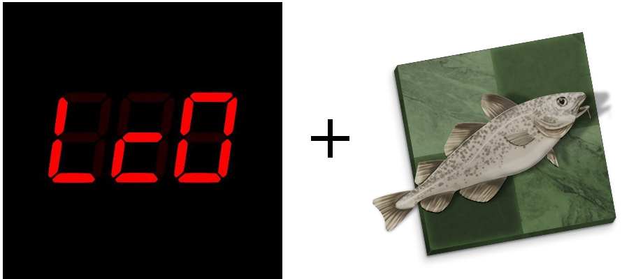
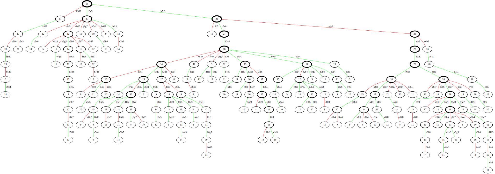
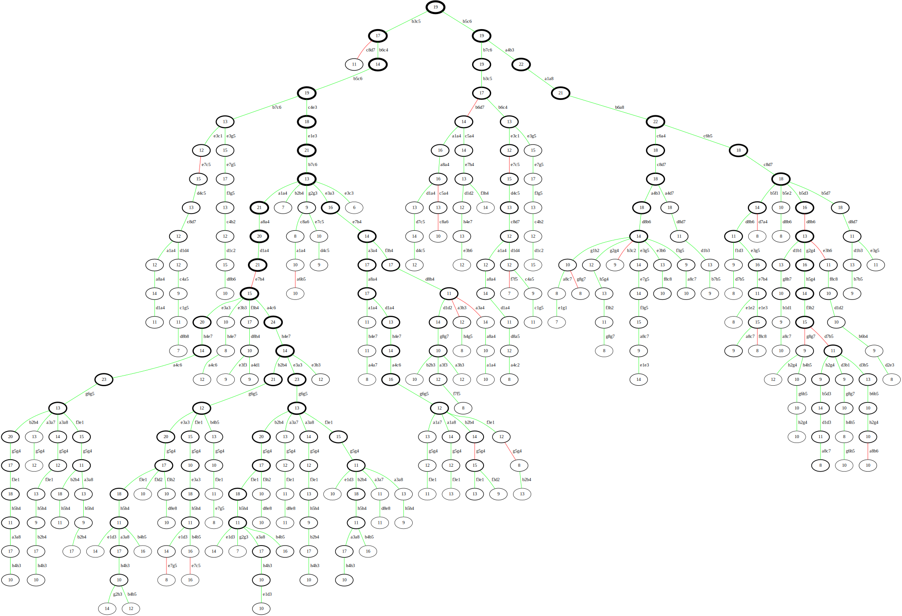
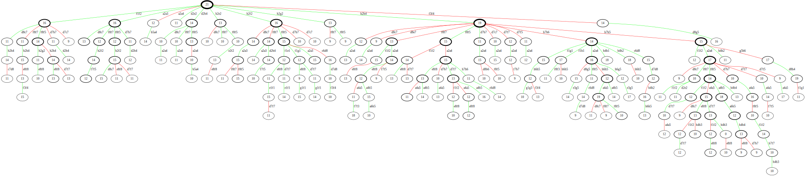
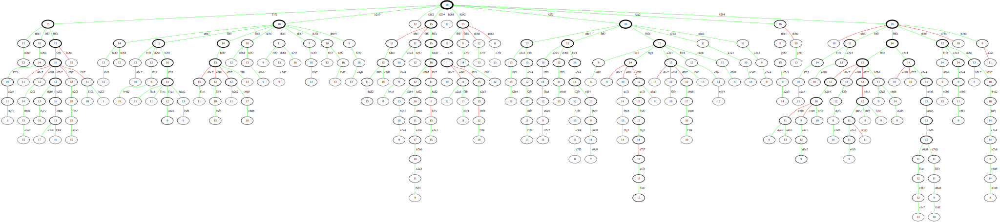

# Lc0-stockfish-hybrid

Lc0-stockfish-hybrid is a (mostly) UCI-compliant chess engine based off two separate projects, [Stockfish](https://stockfishchess.org/) the leading traditional chess engine, and [LC0, or leela](https://lczero.org/) the leading open source neural network chess engine based off AlphaZero.

## Build instructions

There are detailed build instructions in [INSTALL.md](INSTALL.md). If you need windows or linux binaries, you can contact me at benblack769@gmail.com.

## Hybrid Project

Both the Lc0 chess engine and the stockfish engine are extremely strong, and have been dramatically improving due to improved heuristics for stockfish, and improved training for Lc0. However, they are very different engines, based off very different methods and strengths, and so the goal is to combine those strengths.

### Comparable strengths and weaknesses

* In head to head matches, typically Lc0 wins reliably, but Stockfish is better at beating weaker engines (avoiding draws more successfully), so Stockfish still wins many engine tournaments.
* On the hardware in these tournaments, stockfish evaluates around 60,000,000 nps, whereas Lc0 evaluates around 60,000. This is 3 orders of mangitude difference, yet they evaluate to a similar depth in most positions (around 35), indicating that stockfish sees a much wider tree, better evaluating more tactics positions, whereas Lc0 sees a deeper tree, evaluating deep endgames and positional weaknesses using its vastly superior heuristic.
* Lc0 is not trained well for winning endgames. It can draw completely winning positions because it thinks every move is winning, including some that are not. In tournaments, a tablebase has to be used to mitigate this problem.
* Stockfish is relatively bad at openings. Opening books are not allowed in tournaments, and stockfish's heuristic is not able to evaluate the complex middle game positions that openings produce.
* Lc0 is relatively bad at tactics, dropping pieces in short time controls.

So how to combine Stockfish's ability to win games and handle tactics with Lc0's ability to evaluate positions?

The idea is to have Lc0 run its MCTS normally, but Stockfish will eliminate moves throughout the evaluating tree it thinks are especially bad. This should help Lc0 not fall for tactics even in deep into its search.

### Algorithm description

The core position evaluation algorithm at the core of Lc0 only has one minor change:

*In selection, do not select moves that Stockfish has evaluated as bad.*

Of course, there are all sorts of details about how much time the  Stockfish is allowed to evaluate each position, and at what point Stockfish is confident enough about its evaluation to start affecting the output, but most of those details aren't really important for the analysis. The main idea is that as a node gets evaluates more, Stockfish evaluates *all* of the children of that node more, allowing branches to be reevaluated by Stockfish if the parent looks good to Lc0, so even if a branch is defined as bad at one point does not mean it will always be evaluated that way, stabilizing the method significantly.

### Visualizations for algorithm

The numbers at each nodes in the graph (and the thickness of the borders) represent how many times the node is visited in the MCTS simulation (the number of subnodes that are evaluated). The red lines are edges which Stockfish has decided are definitely bad, and which will no longer be explored (but their values are still included in the evaluations of parent nodes, for evaluation stability). Nodes with less than 5 children are pruned.
<!--

-->

#### Tactical positions

Here is a evaluation graph in a sharp middlegame position where every single move is forced, the kind where Stockfish shows its best strengths.

Vanilla Lc0 evaluating 1000 nodes

Hybrid approach with Lc0 evaluating 1000 nodes

As you can see, adding the Stockfish signal completely changes the resulting evaluation tree. In particular, note that the tree searches much deeper, presumably because Stockfish's signal eliminates enough moves that it is more confident about where it should search.

Of course, Stockfish generally does make the best move in these sort of positions, so you might wonder why you can't just have Stockfish make the move, but the idea is that sometimes there might be two possible moves with very sharp subtrees that terminate in very positional endgames, and you still want Lc0 to evaluate the conclusion of different forced moved sequences.

#### Positional positions

Here is an evaluation graph of a very slow middlegame where stockfish thinks that at least 10 moves at each node for 5 move are OK, i.e., it has no strong opinions about the position. Lc0 seems to evaluate the position better, as the hybrid engine eventually beat Stockfish from this position, despite the signal from Stockfish being quite useless.

Vanilla Lc0 evaluating 1000 nodes

Hybrid approach with Lc0 evaluating 1000 nodes

In this case, the evaluation tree still changes, but much less than in the tactical position. Many parts of the subtree are similar, the depth of various parts of the tree are similar. This means that when Stockfish is not as strong in the position, it does not interfere with Lc0's normal evaluations very much.

### Performance vs Stockfish

I accidentally deleted all this data :( Working to recreate.

### Performance vs Lc0

I accidentally deleted all this data too :( Working to recreate.

Out of maybe 100 games vs Lc0, in time controls from 3+2min to 15+10, I have seen it win maybe once. The draw rate is incredibly high, but in general, the hybrid method loses head to Lc0 very consistently. I suspect that is because the Lc0 evaluation of both engines guides it into positions it is comfortable in, meaning less tactically sharp ones, so the stockfish evaluation does not add much, and sometimes it gets in the way to some small degree.

## License (copied from Lc0)

Leela Chess is free software: you can redistribute it and/or modify
it under the terms of the GNU General Public License as published by
the Free Software Foundation, either version 3 of the License, or
(at your option) any later version.

Leela Chess is distributed in the hope that it will be useful,
but WITHOUT ANY WARRANTY; without even the implied warranty of
MERCHANTABILITY or FITNESS FOR A PARTICULAR PURPOSE.  See the
GNU General Public License for more details.

You should have received a copy of the GNU General Public License
along with Leela Chess.  If not, see <http://www.gnu.org/licenses/>.

### Additional permission under GNU GPL version 3 section 7

_The source files of Lc0 with the exception of the BLAS and OpenCL
backends (all files in the `blas` and `opencl` sub-directories) have
the following additional permission, as allowed under GNU GPL version 3
section 7:_

If you modify this Program, or any covered work, by linking or
combining it with NVIDIA Corporation's libraries from the NVIDIA CUDA
Toolkit and the NVIDIA CUDA Deep Neural Network library (or a
modified version of those libraries), containing parts covered by the
terms of the respective license agreement, the licensors of this
Program grant you additional permission to convey the resulting work.
